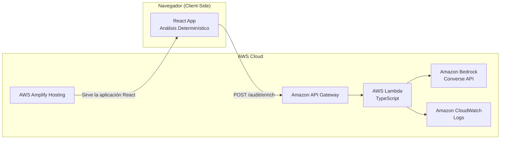
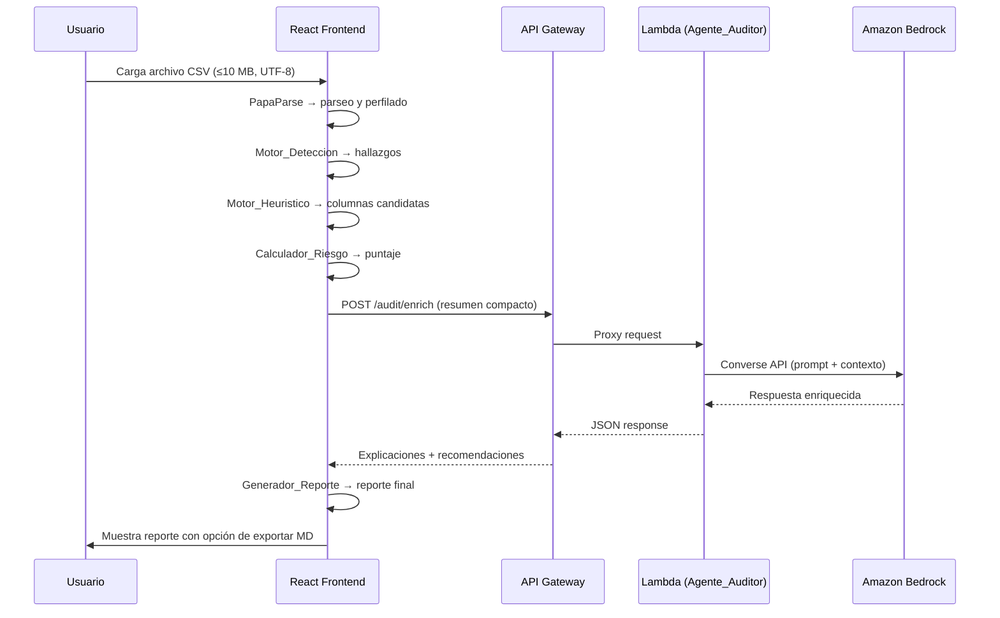

# Documento de Diseño — Pipeline Risk Auditor

## 1. Visión General

Pipeline Risk Auditor es una herramienta web que analiza archivos CSV para detectar riesgos de calidad de datos antes de su ingesta en pipelines. El análisis determinístico se ejecuta íntegramente en el navegador (client-side), mientras que un **Agente_Auditor** desplegado en AWS enriquece los hallazgos con explicaciones contextuales, priorización de riesgos y recomendaciones correctivas generadas mediante Amazon Bedrock.

El sistema genera un puntaje de riesgo (0–100), identifica columnas candidatas a clave o carga incremental, y produce un reporte exportable en Markdown. Si el Agente_Auditor no está disponible, el sistema opera en modo degradado con explicaciones basadas en reglas.

### Flujo Principal

1. El usuario carga un archivo CSV (≤ 10 MB, UTF-8).
2. El frontend parsea, perfila y ejecuta detección determinística.
3. Se calcula el puntaje de riesgo y se identifican columnas candidatas.
4. Se envía un resumen compacto al Agente_Auditor (POST /audit/enrich).
5. El agente interpreta hallazgos y devuelve explicaciones enriquecidas.
6. Se presenta el reporte completo con opción de exportación Markdown.

---

## 2. Decisiones de Diseño Clave

| Decisión | Elección | Justificación |
|----------|----------|---------------|
| Framework frontend | React + TypeScript + Tailwind CSS | Stack conocido, rápido de iterar en hackathon |
| Parseo CSV | PapaParse (client-side) | Librería madura, streaming, sin backend para parseo |
| Análisis determinístico | Client-side en el navegador | Reduce latencia, no requiere enviar datos al servidor |
| Componente IA | Agente_Auditor en AWS Lambda | Lógica de agente especializado con Bedrock Converse API |
| Modelo LLM | Amazon Bedrock (Converse API) — modelo configurable | Servicio gestionado; el modelo se selecciona durante el despliegue según disponibilidad, región, permisos y costo |
| Hosting | AWS Amplify | Despliegue continuo desde repositorio |
| API | Amazon API Gateway + Lambda | Serverless, escalable, sin servidores que mantener |
| Almacenamiento | Ninguno (stateless) | MVP sin persistencia; datos viven en sesión del navegador |
| Codificación CSV | Solo UTF-8 (MVP) | Simplifica parseo; Latin-1 es funcionalidad futura |
| Tamaño máximo CSV | 10 MB | Razonable para análisis in-browser sin problemas de memoria |
| Autenticación | Ninguna (MVP) | No requerida para demostración de hackathon |

---

## 3. Arquitectura

### Diagrama de Arquitectura AWS



### Diagrama de Flujo de Datos



### Componentes del Sistema

| Componente | Ubicación | Responsabilidad |
|------------|-----------|-----------------|
| Analizador_CSV | Frontend | Parseo, perfilado, inferencia de tipos |
| Motor_Deteccion | Frontend | Reglas determinísticas de calidad |
| Motor_Heuristico | Frontend | Identificación de columnas candidatas |
| Calculador_Riesgo | Frontend | Fórmula de puntaje agregado |
| Generador_Reporte | Frontend | Renderizado y exportación Markdown |
| Agente_Auditor | Lambda (AWS) | Enriquecimiento con IA vía Bedrock |

---

## 4. Componentes e Interfaces

### 4.1 Analizador_CSV

Responsable de cargar, parsear con PapaParse y generar el perfil estructural del CSV.

```typescript
interface ColumnProfile {
  name: string;
  inferredType: 'string' | 'number' | 'date' | 'boolean' | 'mixed';
  nullCount: number;
  emptyCount: number;
  uniqueCount: number;
  sampleValues: string[];
}

interface CSVSummary {
  rowCount: number;
  columnCount: number;
  columns: ColumnProfile[];
  parseErrors: string[];
}

interface AnalizadorCSV {
  parse(file: File): Promise<CSVSummary>;
  validateFile(file: File): { valid: boolean; error?: string };
}
```

**Restricciones de validación:**
- Tamaño máximo: 10 MB
- Codificación: solo UTF-8 (MVP)
- El archivo debe contener al menos una fila de datos además del encabezado

### 4.2 Motor_Deteccion

Ejecuta reglas determinísticas para identificar problemas de calidad.

```typescript
type Severity = 'alto' | 'medio' | 'bajo';

interface Finding {
  id: string;
  category: 'nulls' | 'empties' | 'duplicates' | 'invalid_dates' | 'late_arriving' | 'mutations';
  severity: Severity;
  description: string;
  affectedColumns?: string[];
  count: number;
  percentage?: number;
  ruleBasedExplanation: string;
  recommendedAction: string;
}

interface DetectionResult {
  findings: Finding[];
  metadata: {
    rulesExecuted: number;
    executionTimeMs: number;
  };
}

interface MotorDeteccion {
  analyze(summary: CSVSummary, rows: Record<string, string>[]): DetectionResult;
}
```

**Regla de datos tardíos (late-arriving):** Solo se ejecuta cuando existen al menos dos columnas temporales compatibles (por ejemplo, una fecha de evento Y una fecha de ingesta/actualización). Si no hay suficiente evidencia, el hallazgo se reporta como "no evaluable".

### 4.3 Motor_Heuristico

Aplica heurísticas para sugerir columnas candidatas a clave o carga incremental.

```typescript
type CandidateType = 'primary_key' | 'business_key' | 'incremental_marker';

interface ColumnCandidate {
  columnName: string;
  candidateType: CandidateType;
  confidence: 'alta' | 'media' | 'baja';
  reasoning: string;
  confirmedByUser: boolean;
}

interface HeuristicResult {
  candidates: ColumnCandidate[];
  insufficientEvidence: boolean;
  message?: string;
}

interface MotorHeuristico {
  evaluate(summary: CSVSummary): HeuristicResult;
}
```

### 4.4 Calculador_Riesgo

Calcula el puntaje de riesgo agregado con fórmula determinística.

```typescript
interface RiskBreakdown {
  findingId: string;
  severity: Severity;
  contribution: number;
}

interface RiskScore {
  total: number; // 0–100 (capped)
  rawTotal: number; // sin cap, para desglose
  breakdown: RiskBreakdown[];
}

interface CalculadorRiesgo {
  calculate(findings: Finding[]): RiskScore;
}
```

**Fórmula:** `min(100, (alto × 20) + (medio × 10) + (bajo × 5))`

### 4.5 Generador_Reporte

Produce el reporte visual en la interfaz y la exportación en Markdown.

```typescript
interface Report {
  structureSummary: CSVSummary;
  findings: Finding[];
  enrichedExplanations?: EnrichedExplanation[];
  candidates: ColumnCandidate[];
  riskScore: RiskScore;
  generatedAt: string;
  aiMode: 'enriched' | 'rules_only';
}

interface GeneradorReporte {
  render(report: Report): React.ReactNode;
  exportMarkdown(report: Report): string;
}
```

### 4.6 Agente_Auditor

Componente central del sistema desplegado en AWS Lambda. El Agente_Auditor es un agente especializado responsable de:

- **Interpretar** hallazgos determinísticos en contexto técnico de ingeniería de datos
- **Priorizar** riesgos según mejores prácticas de data engineering
- **Explicar** el impacto técnico de cada hallazgo
- **Generar** acciones correctivas contextualizadas
- **Producir** un resumen ejecutivo del análisis

No es un componente decorativo: es la pieza central de la demostración del hackathon.

```typescript
interface EnrichRequest {
  structureSummary: {
    rowCount: number;
    columnCount: number;
    columns: { name: string; inferredType: string }[];
  };
  findings: {
    category: string;
    severity: Severity;
    description: string;
    count: number;
    percentage?: number;
  }[];
  candidates: {
    columnName: string;
    candidateType: CandidateType;
    confidence: string;
  }[];
  riskScore: number;
}

interface EnrichedExplanation {
  findingId: string;
  technicalImpact: string;
  contextualExplanation: string;
  correctiveAction: string;
  priority: 'critical' | 'high' | 'medium' | 'low';
}

interface EnrichResponse {
  explanations: EnrichedExplanation[];
  executiveSummary: string;
  overallRiskAssessment: string;
  source: 'ai';
}

interface AgenteAuditor {
  enrich(request: EnrichRequest): Promise<EnrichResponse>;
}
```

**Comportamiento del Agente_Auditor:**

1. Recibe el payload compacto (NO el CSV completo ni todas las filas).
2. Construye un prompt estructurado con contexto de data engineering.
3. Invoca Amazon Bedrock vía Converse API.
4. Parsea la respuesta y la estructura en `EnrichResponse`.
5. Si Bedrock falla o excede el timeout, retorna un error que dispara el modo degradado en el frontend.

> **Nota sobre el modelo:** El `BEDROCK_MODEL_ID` es una variable configurable. El modelo definitivo se seleccionará durante el despliegue según: (1) disponibilidad en la cuenta AWS, (2) disponibilidad en la región elegida, (3) permisos de acceso al modelo (Model Access habilitado en la consola de Bedrock), y (4) costo y latencia apropiados para la hackathon.

---

## 5. Endpoint POST /audit/enrich

### Especificación

| Campo | Valor |
|-------|-------|
| Método | POST |
| Path | /audit/enrich |
| Content-Type | application/json |
| Timeout | 30 segundos |

### Request Body

```json
{
  "structureSummary": {
    "rowCount": 15000,
    "columnCount": 12,
    "columns": [
      { "name": "order_id", "inferredType": "number" },
      { "name": "created_at", "inferredType": "date" },
      { "name": "customer_name", "inferredType": "string" }
    ]
  },
  "findings": [
    {
      "category": "nulls",
      "severity": "alto",
      "description": "Columna 'email' tiene 23% de valores nulos",
      "count": 3450,
      "percentage": 23.0
    }
  ],
  "candidates": [
    {
      "columnName": "order_id",
      "candidateType": "primary_key",
      "confidence": "alta"
    }
  ],
  "riskScore": 65
}
```

**Restricciones del payload:**
- NO se envía el archivo CSV completo
- NO se envían todas las filas de datos
- Solo se envía el resumen estructural, hallazgos determinísticos, columnas candidatas y puntaje
- Tamaño máximo del payload: 64 KB
- Nombres de columnas: máximo 128 caracteres, sanitizados

### Response Body (éxito)

```json
{
  "explanations": [
    {
      "findingId": "nulls-email",
      "technicalImpact": "Un 23% de nulos en email puede causar fallos en JOINs downstream y pérdida de registros en reportes de contactabilidad.",
      "contextualExplanation": "En pipelines de CRM, la columna email suele ser clave de unificación de clientes. Nulos altos sugieren problemas en la fuente o en la extracción.",
      "correctiveAction": "Investigar la fuente del dato. Implementar validación NOT NULL en el esquema destino o agregar un paso de data quality con valor por defecto.",
      "priority": "high"
    }
  ],
  "executiveSummary": "El archivo presenta riesgo medio-alto (65/100). El hallazgo más crítico es la alta nulidad en campos de contacto...",
  "overallRiskAssessment": "Se recomienda no ingestar sin resolución de nulos en columnas críticas.",
  "source": "ai"
}
```

### Response Body (error)

```json
{
  "error": "BEDROCK_TIMEOUT",
  "message": "El servicio de IA no respondió en el tiempo esperado.",
  "fallbackAdvice": "Utilice las explicaciones basadas en reglas."
}
```

---

## 6. Modelos de Datos

### AppState (React Context) — Optimizado para Memoria

Después del análisis, NO se almacenan todas las filas del CSV en el estado de React. Solo se mantiene:

```typescript
interface AppState {
  // Estado de carga
  fileInfo: {
    name: string;
    size: number;
    loadedAt: string;
  } | null;

  // Resumen (NO todas las filas)
  summary: CSVSummary | null;

  // Muestra limitada de filas (máximo 10 filas para preview)
  sampleRows: Record<string, string>[] | null; // máx 10 filas

  // Resultados del análisis
  findings: Finding[];
  candidates: ColumnCandidate[];
  riskScore: RiskScore | null;

  // Enriquecimiento IA
  enrichment: EnrichResponse | null;
  aiStatus: 'idle' | 'loading' | 'success' | 'error';

  // Estado de la UI
  analysisPhase: 'idle' | 'parsing' | 'analyzing' | 'enriching' | 'complete';
  error: string | null;
}
```

**Estrategia de memoria:**
- Durante el parseo, se procesan las filas para generar `CSVSummary` y `Finding[]`.
- Las filas completas se liberan después de la fase de análisis.
- Solo se retienen `sampleRows` (primeras 10 filas) para preview en la UI.
- Esto permite manejar archivos de hasta 10 MB sin degradar la experiencia.

---

## 7. Seguridad

### 7.1 Credenciales

- **NO** se incluyen credenciales de AWS en el código frontend.
- La Lambda usa un IAM Role con permisos mínimos (solo `bedrock:InvokeModel` y `logs:*`).
- Las variables de entorno sensibles se configuran en Lambda, nunca en el frontend.
- El recurso IAM para `bedrock:InvokeModel` debe restringirse al ARN específico del modelo seleccionado una vez que se confirme durante el despliegue. El wildcard `"*"` en el template es un placeholder inicial.

### 7.2 Validación de Payload

- **API Gateway**: Validación de esquema JSON del request body. Payload máximo 64 KB.
- **Lambda**: Validación secundaria de estructura y tipos antes de procesar.
- Nombres de columnas: máximo 128 caracteres, solo caracteres alfanuméricos, guiones y guiones bajos.
- Valores de muestra: truncados a 256 caracteres si exceden el límite.

### 7.3 CORS

- CORS restringido exclusivamente al dominio del frontend desplegado en Amplify.
- No se permite `*` como origen en producción.

### 7.4 Prevención de Prompt Injection

- TODO el contenido del CSV se trata como datos no confiables (untrusted data).
- Los nombres de columnas y valores se sanitizan antes de incluirlos en el prompt a Bedrock.
- Se aplican delimitadores claros en el prompt para separar instrucciones del sistema de datos del usuario.
- Nunca se interpretan valores del CSV como instrucciones para el modelo.

### 7.5 Timeouts y Fallback

- Timeout de API Gateway: 30 segundos.
- Timeout de invocación a Bedrock: 25 segundos (margen para procesamiento Lambda).
- Si el timeout se excede, se retorna error y el frontend activa modo degradado (reglas determinísticas).

### 7.6 Límites de Entrada (Frontend)

- Tamaño máximo de archivo: 10 MB.
- Solo archivos con extensión `.csv`.
- Solo codificación UTF-8.
- Validación client-side antes de iniciar el parseo.

---

## 8. Manejo de Errores

| Escenario | Componente | Comportamiento |
|-----------|------------|----------------|
| Archivo no es CSV válido | Analizador_CSV | Mensaje descriptivo, no se inicia análisis |
| Archivo excede 10 MB | Analizador_CSV | Mensaje con el límite, se rechaza el archivo |
| Archivo no es UTF-8 | Analizador_CSV | Mensaje indicando que solo se soporta UTF-8 |
| Error de parseo en filas | Analizador_CSV | Se reportan filas con error, análisis continúa con filas válidas |
| Bedrock timeout | Agente_Auditor | Retorna error, frontend activa modo degradado |
| Bedrock error genérico | Agente_Auditor | Log en CloudWatch, retorna error al frontend |
| Payload inválido en API | API Gateway | HTTP 400 con descripción del error de validación |
| Lambda error interno | Lambda | HTTP 500, log en CloudWatch, frontend activa fallback |
| Sin columnas temporales | Motor_Deteccion | Late-arriving data reportado como "no evaluable" |

**Principio de diseño:** El sistema siempre produce un reporte útil. Los errores en el enriquecimiento con IA degradan la experiencia pero no bloquean el resultado.

---

## 9. Propiedades de Correctitud

*Una propiedad es una característica o comportamiento que debe mantenerse verdadero en todas las ejecuciones válidas de un sistema — esencialmente, una declaración formal sobre lo que el sistema debe hacer. Las propiedades sirven como puente entre especificaciones legibles por humanos y garantías de correctitud verificables por máquina.*

Para el MVP, se definen **3 propiedades** verificables con property-based testing (fast-check):

### Propiedad 1: Correctitud de la fórmula de puntaje de riesgo

*Para cualquier* combinación de hallazgos con severidades alto, medio y bajo, el puntaje de riesgo calculado por Calculador_Riesgo DEBE ser igual a `min(100, (cantidad_alto × 20) + (cantidad_medio × 10) + (cantidad_bajo × 5))`. Además, el puntaje siempre debe estar en el rango [0, 100].

**Valida: Requisitos 5.1, 5.2, 5.4**

### Propiedad 2: Correctitud del conteo de nulos y vacíos

*Para cualquier* conjunto de datos tabulares (filas y columnas), el conteo de valores nulos reportado por Motor_Deteccion para cada columna DEBE ser exactamente igual al número real de celdas con valor null/undefined en esa columna, y el conteo de vacíos DEBE ser exactamente igual al número real de celdas con cadena vacía o solo espacios en blanco.

**Valida: Requisitos 2.1, 2.2**

### Propiedad 3: Correctitud del conteo de duplicados

*Para cualquier* conjunto de filas, el número de filas duplicadas reportado por Motor_Deteccion DEBE ser exactamente igual al número real de filas que son copia exacta de otra fila en el dataset (total de filas menos filas únicas).

**Valida: Requisito 2.3**

---

## 10. Estrategia de Testing

### Enfoque Dual para MVP

El testing del MVP combina tests unitarios para verificar comportamiento específico y property-based tests para validar propiedades universales en los módulos críticos.

### Tests Unitarios (Vitest)

| Módulo | Tests |
|--------|-------|
| Analizador_CSV | Parseo correcto, rechazo de archivos inválidos, límite 10 MB, detección de no-UTF-8 |
| Motor_Deteccion | Detección de nulos, vacíos, duplicados, fechas inválidas, clasificación de severidad, regla late-arriving con/sin columnas temporales suficientes |
| Motor_Heuristico | Identificación de candidatas a PK, business key, incremental marker; caso sin evidencia suficiente |
| Calculador_Riesgo | Fórmula correcta, cap a 100, desglose, caso sin hallazgos |
| Generador_Reporte | Contenido del reporte, exportación Markdown correcta |

### Property-Based Tests (fast-check)

Configuración: **mínimo 100 iteraciones** por propiedad.

```typescript
// Feature: pipeline-risk-auditor, Property 1: Risk score formula correctness
test.prop(
  'risk score equals min(100, alto*20 + medio*10 + bajo*5)',
  [fc.nat(50), fc.nat(50), fc.nat(50)],
  (altoCount, medioCount, bajoCount) => {
    const findings = generateFindings(altoCount, medioCount, bajoCount);
    const result = calculateRiskScore(findings);
    const expected = Math.min(100, altoCount * 20 + medioCount * 10 + bajoCount * 5);
    expect(result.total).toBe(expected);
    expect(result.total).toBeGreaterThanOrEqual(0);
    expect(result.total).toBeLessThanOrEqual(100);
  }
);
```

```typescript
// Feature: pipeline-risk-auditor, Property 2: Null and empty count correctness
test.prop(
  'null and empty counts match actual occurrences',
  [fc.array(fc.array(fc.oneof(fc.constant(null), fc.constant(''), fc.constant('  '), fc.string())))],
  (grid) => {
    const { summary, findings } = analyzeGrid(grid);
    for (const col of summary.columns) {
      const actualNulls = countActualNulls(grid, col.name);
      const actualEmpties = countActualEmpties(grid, col.name);
      expect(col.nullCount).toBe(actualNulls);
      expect(col.emptyCount).toBe(actualEmpties);
    }
  }
);
```

```typescript
// Feature: pipeline-risk-auditor, Property 3: Duplicate count correctness
test.prop(
  'duplicate count equals total rows minus unique rows',
  [fc.array(fc.array(fc.string(), { minLength: 3, maxLength: 3 }), { minLength: 1 })],
  (rows) => {
    const duplicateCount = detectDuplicates(rows);
    const uniqueRows = new Set(rows.map(r => JSON.stringify(r))).size;
    expect(duplicateCount).toBe(rows.length - uniqueRows);
  }
);
```

### Test de Integración

Un test de integración del flujo completo:

1. Carga un CSV de ejemplo.
2. Ejecuta parseo → detección → heurística → cálculo de riesgo.
3. Envía resumen al endpoint `/audit/enrich` (mock de Lambda/Bedrock).
4. Verifica que el reporte final contiene todos los hallazgos y explicaciones.

### Herramientas

- **Framework**: Vitest (con flag `--run` para ejecución única)
- **PBT**: fast-check
- **Mocks**: msw (Mock Service Worker) para el endpoint del Agente_Auditor

---

## 11. Despliegue del MVP en AWS

### 11.1 Frontend — AWS Amplify Hosting

- El frontend (React + TypeScript + Tailwind) se despliega desde el repositorio Git.
- Amplify detecta el framework y ejecuta `npm run build` automáticamente.
- Se configura el dominio generado por Amplify como origen CORS permitido.
- Variables de entorno del frontend (solo la URL del API Gateway):
  - `VITE_API_URL`: URL base del API Gateway (e.g., `https://abc123.execute-api.us-east-1.amazonaws.com/prod`)

### 11.2 Backend — Lambda + API Gateway

**Opción de despliegue recomendada:** AWS SAM (Serverless Application Model)

```yaml
# template.yaml (SAM)
AWSTemplateFormatVersion: '2010-09-09'
Transform: AWS::Serverless-2016-10-31

Globals:
  Function:
    Timeout: 30
    Runtime: nodejs20.x
    MemorySize: 256

Resources:
  AuditEnrichFunction:
    Type: AWS::Serverless::Function
    Properties:
      Handler: dist/handler.handler
      CodeUri: backend/
      # El modelo se configura durante el despliegue. Verificar disponibilidad
      # en la cuenta y región antes de seleccionar (ej: anthropic.claude-*, amazon.titan-*, etc.)
      Environment:
        Variables:
          BEDROCK_MODEL_ID: "MODELO_A_CONFIGURAR"  # Seleccionar según disponibilidad en la cuenta/región
          BEDROCK_REGION: "us-east-1"
          ALLOWED_ORIGIN: "https://main.d1abc2def3.amplifyapp.com"
      Policies:
        - Statement:
            - Effect: Allow
              Action: bedrock:InvokeModel
              Resource: "*"  # Restringir al ARN del modelo seleccionado una vez confirmado
      Events:
        AuditEnrich:
          Type: Api
          Properties:
            Path: /audit/enrich
            Method: post

Outputs:
  ApiUrl:
    Value: !Sub "https://${ServerlessRestApi}.execute-api.${AWS::Region}.amazonaws.com/Prod"
```

### 11.3 Variables de Entorno

| Variable | Ubicación | Descripción |
|----------|-----------|-------------|
| `VITE_API_URL` | Amplify (frontend) | URL del API Gateway |
| `BEDROCK_MODEL_ID` | Lambda | ID del modelo de Bedrock (configurable; seleccionar según disponibilidad en cuenta/región, permisos y costo) |
| `BEDROCK_REGION` | Lambda | Región de AWS donde está habilitado Bedrock |
| `ALLOWED_ORIGIN` | Lambda | Dominio del frontend para CORS |

### 11.4 Proceso de Despliegue

1. **Backend primero:**
   ```bash
   cd backend
   npm install && npm run build
   sam build && sam deploy --guided
   ```
   Tomar nota de la URL del API Gateway generada.

2. **Frontend:**
   - Configurar `VITE_API_URL` en las variables de entorno de Amplify.
   - Hacer push al repositorio. Amplify detecta el cambio y despliega automáticamente.

3. **Verificación:**
   - Acceder a la URL de Amplify.
   - Cargar un CSV de prueba.
   - Verificar que el Agente_Auditor responde (o que el fallback funciona).
   - Revisar logs en CloudWatch.

---

## 12. Cómo se Evidencia el Uso de Kiro y AWS en la Hackathon

### 12.1 Uso de Kiro

| Evidencia | Descripción |
|-----------|-------------|
| Spec-driven development | El directorio `.kiro/specs/` contiene requirements.md, design.md y tasks.md generados por Kiro |
| Workflow requirements-first | Se siguió el flujo Requisitos → Diseño → Tareas con validación en cada paso |
| Propiedades de correctitud | Las 3 propiedades PBT fueron definidas en el diseño y ejecutadas con fast-check |
| Trazabilidad | Cada tarea y test referencia requisitos específicos del documento |
| Iteración con feedback | El diseño incorpora feedback iterativo documentado en el flujo de Kiro |

**Cómo verificarlo:** Los jueces pueden inspeccionar `.kiro/specs/pipeline-risk-auditor/` para ver el proceso completo de especificación.

### 12.2 Uso de AWS

| Servicio AWS | Función | Evidencia |
|--------------|---------|-----------|
| AWS Amplify Hosting | Publica el frontend React | URL funcional del frontend en Amplify |
| Amazon API Gateway | Expone el endpoint `/audit/enrich` | Invocación visible en la demo |
| AWS Lambda (TypeScript) | Ejecuta la lógica del Agente_Auditor | Logs en CloudWatch, latencia visible |
| Amazon Bedrock (Converse API) | Genera explicaciones y recomendaciones | Respuestas contextuales en el reporte |
| Amazon CloudWatch | Logging de Lambda | Logs accesibles en la consola AWS |

**Cómo verificarlo durante la demo:**
1. Cargar un CSV → se muestra el reporte con explicaciones de IA (Bedrock).
2. Mostrar la consola de CloudWatch con logs de la invocación Lambda.
3. Mostrar la consola de Amplify con el despliegue activo.
4. Mostrar la configuración del API Gateway con el endpoint configurado.
5. Desconectar Bedrock (timeout forzado) → el sistema opera en modo degradado con reglas.

---

## 13. Funcionalidades Futuras

Las siguientes mejoras están fuera del alcance del MVP pero son extensiones naturales del sistema:

| Funcionalidad | Descripción |
|---------------|-------------|
| Soporte Latin-1 | Detección automática de codificación y conversión a UTF-8 |
| PBT adicionales | Properties para validación de fechas, heurísticas de candidatas, formato de reporte |
| Exportación PDF | Generación de reporte en PDF con formato profesional |
| Análisis SQL | Parseo de consultas SQL para detectar anti-patrones (Requisito 8) |
| Metadatos de tabla | Comparación de CSV con esquema destino (Requisito 9) |
| Persistencia | Historial de análisis con DynamoDB o S3 |
| Autenticación | Cognito para control de acceso |
| Análisis batch | Procesamiento de múltiples CSVs en paralelo |
| Dashboard de tendencias | Visualización de evolución de calidad de datos en el tiempo |
| Webhooks/Alertas | Notificaciones cuando un archivo excede umbrales de riesgo |
