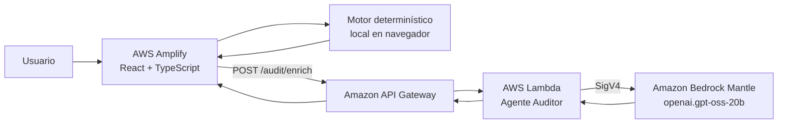

# Pipeline Risk Auditor

Herramienta de auditoría de calidad de datos que analiza archivos CSV para detectar riesgos antes de su ingesta en pipelines de datos. Genera un puntaje de riesgo, hallazgos accionables y explicaciones enriquecidas por IA.

## Problema que resuelve

Los pipelines de datos frecuentemente ingestan archivos con problemas de calidad que se propagan silenciosamente: valores nulos, duplicados, fechas inválidas o estructuras inconsistentes. Detectar estos problemas manualmente es lento y propenso a errores.

Pipeline Risk Auditor automatiza la detección de riesgos de calidad de datos en archivos CSV, proporcionando un análisis determinístico inmediato complementado con explicaciones contextuales generadas por IA.

## Aplicación desplegada

https://main.d15yyirx1kaofe.amplifyapp.com

## Funcionalidades principales

- **Carga y análisis de archivos CSV**: validación de formato, tamaño y estructura; perfilado automático de columnas.
- **Motor determinístico de hallazgos**: detección de nulos, vacíos, duplicados exactos y fechas inválidas con clasificación de severidad (alto, medio, bajo).
- **Identificación heurística de columnas candidatas**: sugerencias de claves primarias, claves de negocio y marcadores de carga incremental con confirmación del usuario.
- **Cálculo de puntaje de riesgo**: fórmula ponderada con desglose por hallazgo, limitado a 100.
- **Enriquecimiento por IA**: explicaciones técnicas, contextuales y acciones correctivas generadas por Amazon Bedrock Mantle. Incluye resumen ejecutivo y evaluación general del riesgo.
- **Modo degradado**: si el servicio de IA no está disponible, el sistema opera con explicaciones basadas en reglas determinísticas sin perder funcionalidad.
- **Exportación del reporte**: descarga del análisis completo en formato Markdown.

## Casos de uso

1. **Validación pre-ingesta**: antes de cargar un CSV en un data lake o warehouse, ejecutar el auditor para identificar riesgos y decidir si proceder o corregir.
2. **Documentación de calidad**: exportar el reporte para adjuntarlo a tickets de revisión o documentación del pipeline.
3. **Identificación de claves**: utilizar las sugerencias heurísticas para confirmar columnas candidatas a clave primaria o marcador incremental.
4. **Evaluación de proveedores de datos**: comparar puntajes de riesgo entre archivos de distintas fuentes.

## Tecnologías

### Frontend

- React 19
- TypeScript
- Vite 6
- Tailwind CSS 4
- PapaParse (parseo de CSV)
- MSW (mocks para desarrollo local)

### Backend

- Node.js (runtime nodejs22.x)
- TypeScript
- AWS Lambda
- AWS SAM (infraestructura como código)
- SigV4 para firma de solicitudes a Bedrock Mantle

### Testing

- Vitest
- fast-check (property-based testing)

## Arquitectura



El análisis determinístico (detección de hallazgos, cálculo de puntaje, heurísticas) se ejecuta completamente en el navegador. Solo el resumen de hallazgos y metadatos se envían al backend para obtener explicaciones enriquecidas por IA. Nunca se envían filas completas del CSV al servidor.

## Servicios AWS utilizados

| Servicio | Función |
|----------|---------|
| AWS Amplify Hosting | Publica y sirve el frontend React |
| Amazon API Gateway | Expone el endpoint `POST /audit/enrich` |
| AWS Lambda | Ejecuta el Agente Auditor (validación, prompt, parseo) |
| Amazon Bedrock Mantle | Genera explicaciones y evaluaciones de riesgo |
| AWS CloudFormation (SAM) | Define y despliega la infraestructura backend |
| Amazon CloudWatch | Logging y monitoreo de invocaciones Lambda |

**Modelo configurado:** `openai.gpt-oss-20b`

## Requisitos previos

- Node.js 22 o superior
- npm 10 o superior
- AWS CLI v2 (para despliegue)
- AWS SAM CLI (para despliegue)

## Instalación y ejecución local

```bash
# Clonar el repositorio
git clone https://github.com/JuanPa-Portugal/pipeline-risk-auditor.git
cd pipeline-risk-auditor

# Instalar dependencias del frontend
npm install

# Iniciar servidor de desarrollo
npm run dev

# Ejecutar tests del frontend
npm test

# Build de producción
npm run build
```

### Backend (desarrollo local)

```bash
cd backend
npm install
npm run build
npm test
```

## Variables de entorno

### Frontend

| Variable | Descripción |
|----------|-------------|
| `VITE_API_URL` | URL base del API Gateway. En desarrollo local se utiliza MSW como mock. |

### Backend (Lambda)

| Variable | Descripción |
|----------|-------------|
| `BEDROCK_MODEL_ID` | Modelo de Bedrock Mantle a utilizar. |
| `ALLOWED_ORIGIN` | Dominio del frontend permitido para CORS. |
| `AWS_REGION` | Proporcionada automáticamente por Lambda. |

> Las credenciales AWS no se almacenan en el repositorio. Lambda utiliza las credenciales temporales de su rol de ejecución.

## Estructura del repositorio

```
pipeline-risk-auditor/
├── src/                          # Frontend React
│   ├── components/               # Componentes de UI
│   ├── modules/                  # Lógica de negocio
│   │   ├── analizador-csv.ts     # Parseo y perfilado de CSV
│   │   ├── motor-deteccion.ts    # Reglas de detección de hallazgos
│   │   ├── motor-heuristico.ts   # Heurísticas de columnas candidatas
│   │   ├── calculador-riesgo.ts  # Fórmula de puntaje de riesgo
│   │   ├── generador-reporte.ts  # Generación de reporte Markdown
│   │   ├── enrichment-client.ts  # Cliente HTTP hacia el backend
│   │   └── orchestrator.ts       # Coordinador del flujo de análisis
│   ├── types/                    # Interfaces y tipos TypeScript
│   ├── context/                  # Estado global con React Context
│   └── mocks/                    # Mocks MSW para desarrollo local
├── backend/                      # Lambda + SAM
│   ├── src/
│   │   ├── handler.ts            # Handler Lambda (validación, prompt, parseo)
│   │   └── mantle-client.ts      # Cliente Bedrock Mantle con SigV4
│   ├── template.yaml             # Template AWS SAM
│   ├── samconfig.toml            # Configuración de despliegue SAM
│   └── vitest.config.ts          # Configuración de tests backend
├── .kiro/specs/                  # Especificaciones generadas con Kiro
│   └── pipeline-risk-auditor/
│       ├── requirements.md       # Requisitos del sistema
│       ├── design.md             # Diseño técnico
│       └── tasks.md              # Plan de implementación
├── docs/                         # Documentación adicional
├── amplify.yml                   # Configuración de build para Amplify
└── package.json                  # Dependencias y scripts del frontend
```

## Desarrollo guiado por especificaciones con Kiro

Este proyecto fue desarrollado utilizando Kiro y su metodología de spec-driven development:

1. **Requirements (requisitos)**: se definieron 7 requisitos funcionales del MVP con historias de usuario y criterios de aceptación en formato EARS.
2. **Design (diseño técnico)**: se documentó la arquitectura, interfaces, contratos de API, seguridad, propiedades de correctitud y plan de despliegue.
3. **Tasks (plan de implementación)**: se descompuso el proyecto en 7 fases secuenciales con tareas verificables, dependencias explícitas y checkpoints por fase.
4. **Implementación progresiva**: cada fase se completó y validó antes de avanzar a la siguiente, desde el motor determinístico local hasta el despliegue completo en AWS.

Las especificaciones están disponibles en `.kiro/specs/pipeline-risk-auditor/`.

## Flujo de uso

1. El usuario carga un archivo CSV desde la interfaz.
2. El frontend parsea el archivo, perfila columnas y ejecuta el motor de detección localmente.
3. Se calculan hallazgos, severidades, candidatas y puntaje de riesgo.
4. Se envía un resumen (nunca filas completas) al backend para obtener explicaciones de IA.
5. Si la IA responde, se muestran explicaciones enriquecidas con badge "IA".
6. Si la IA no responde, se muestran explicaciones basadas en reglas con banner de modo degradado.
7. El usuario puede confirmar o rechazar columnas candidatas y exportar el reporte en Markdown.

## Observabilidad y privacidad

La Lambda del Agente Auditor emite logs estructurados en formato JSON hacia Amazon CloudWatch, permitiendo monitorear el rendimiento y diagnosticar problemas sin exponer datos sensibles.

**Eventos registrados:** `mantle_started`, `mantle_completed`, `mantle_timeout`, `mantle_error`, `mantle_unexpected_error`.

Cada log incluye un `requestId` que permite correlacionar el inicio y la finalización de una invocación, junto con `findingCount`, `durationMs` y `explanationCount` según corresponda.

**Privacidad:** Los logs no contienen prompts, filas del CSV, valores de datos, nombres de columnas ni texto generado por la IA.

Para más detalles, consultar [docs/aws-setup.md](docs/aws-setup.md) y [docs/checklist-demo.md](docs/checklist-demo.md).


## Limitaciones actuales

- Solo soporta archivos CSV con codificación UTF-8.
- Tamaño máximo de archivo: 10 MB.
- La detección de datos tardíos es de baja prioridad y puede reportar "no evaluable" si no existen al menos dos columnas temporales compatibles.
- Los nombres de columnas se sanitizan a caracteres alfanuméricos y guiones; caracteres especiales se eliminan.
- La API no tiene autenticación configurada (MVP).
- Los permisos IAM utilizan `Resource: "*"` para el MVP.
- No soporta exportación en PDF (funcionalidad futura).
- No soporta análisis de consultas SQL ni metadatos de tablas destino (funcionalidades futuras).
